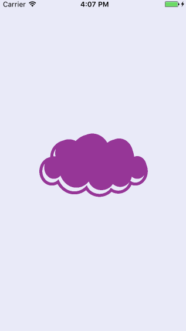

# Group Project: *Memoir*

**Memoir** has been programmatically animated with Swift (iOS) as a team project for [CodePath iOS for Designers](http://codepath.com/iosfordesigners).

### Team members
[**Monith Ilavarasan**](https://github.com/Monith)

[**Namrata Mohanty**](https://github.com/nmohanty)

[**Sophia Kecir Camper**](https://github.com/sophiakc)

### App Description

Personal diary sending text entries to iCal, stored securely and providing visual feedbacks in a calendar view.

### Walkthrough demo

### Demo Day Presentation video

### Notes 
Looking to implement Google Calendar API in the first place, but the official Google documentation is outdated :-(

## License

    Copyright [2016] Memoir

    Licensed under the Apache License, Version 2.0 (the "License");
    you may not use this file except in compliance with the License.
    You may obtain a copy of the License at

        http://www.apache.org/licenses/LICENSE-2.0

    Unless required by applicable law or agreed to in writing, software
    distributed under the License is distributed on an "AS IS" BASIS,
    WITHOUT WARRANTIES OR CONDITIONS OF ANY KIND, either express or implied.
    See the License for the specific language governing permissions and
    limitations under the License.
